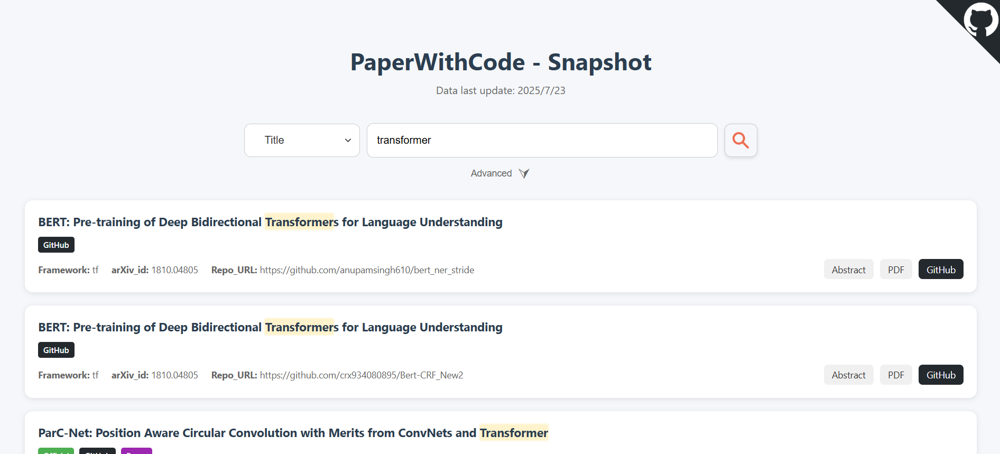

# PaperWithCode - Snapshot

一个已经挂了的机器学习论文代码网站 <a href="https://github.com/paperswithcode">PaperWithCode</a> 的仿制快照网站，数据是 2025/07/23 的，目前只在本地服务器跑跑。

## 功能介绍

功能还很单薄，只支持按论文标题、`arxiv_id` 和代码仓库 `url` 搜索，并且支持正则表达式搜索以及区分大小写。

左中间有三个标签：
<span style="padding: 4px 8px;border-radius: 4px;font-size: 12px;font-weight: 500;  background-color: #4caf50;color: white;">Official</span> 表示代码是由官方产出的
<span style="padding: 4px 8px;border-radius: 4px;font-size: 12px;font-weight: 500;  background-color: #24292e;color: white;">GitHub</span> 表示在GitHub中有提及
 <span style="padding: 4px 8px;border-radius: 4px;font-size: 12px;font-weight: 500;  background-color: #9c27b0;color: white;">Paper</span> 表示在论文中有提及

左下角三个标签分别为代码使用的框架、arxiv_id（小数点前四位数字中，前两位表示年份，后两位表示月份；小数点后的五位数字是序号）、GitHub仓库链接。

右下角是三个链接，分别对应论文摘要页、论文PDF页、GitHub仓库页。

## 部署

**后端**：

```sh
cd backend
python backend.py
```

**前端**（新开一个终端）：

```sh
cd frontend
python -m http.server 5500
```

随后在浏览器打开 <http://localhost:5500> 或 <http://127.0.0.1:5500> 即可。

## 展示

